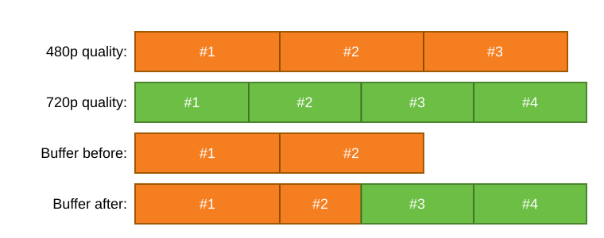

At [Demuxed 2022](https://2022.demuxed.com/), I gave a talk about rebuilding the HTML5 `<video>` element from scratch, buffering, decoding and rendering video myself with [Custom Elements] and [WebCodecs] instead of an actual `<video>` tag.
Watch the talk below, or keep reading for the full story of why (and how) I built this crazy contraption.

<script>
import Video from "#lib/components/Video.svelte";
import Iframe from "#lib/components/Iframe.svelte";
import BaselineStatus from "#lib/components/BaselineStatus.svelte";
import Transcript from "./transcript.md";
</script>

## Watch the talk

<figure>

<Video
src="https://www.youtube.com/watch?v&equals;OBhlTcllq_E&list&equals;PLkyaYNWEKcOf98lZxnCcL6y7ZIVU3oSYO&index&equals;8"
title="Video of recording at Demuxed 2022"></Video>

<figcaption>

[Watch on YouTube](https://www.youtube.com/watch?v=OBhlTcllq_E&list=PLkyaYNWEKcOf98lZxnCcL6y7ZIVU3oSYO&index=8)

</figcaption>

</figure>

<figure>

<Iframe 
src="https://docs.google.com/presentation/d/e/2PACX-1vSypp6ODhxyzM0BqhXPNh3aGwk2nSbiasBqgHTuUC2Iy61B6qOegs0I7jKUJBPCZw/embed" 
title="Slides"></Iframe>

<figcaption>

[View on Google Slides](https://docs.google.com/presentation/d/1XK_Hwyt1fBHAqCRtlkocP5SsNjut4dKD/edit?usp=sharing&ouid=109623083800242291424&rtpof=true&sd=true)

</figcaption>

</figure>

<details>
<summary>Transcript</summary>
<Transcript />
</details>

## Motivation

For videos on the web, everything starts with the [HTML `<video>` element](https://developer.mozilla.org/en-US/docs/Web/HTML/Element/video):

```html
<video controls src="https://example.com/video.mp4"></video>
```

This gives you a basic but fully functional player right inside your website or web app. Like so:

<!-- svelte-ignore a11y_media_has_caption -->

<video controls src="https://interactive-examples.mdn.mozilla.net/media/cc0-videos/flower.mp4"></video>

This is fine for short, simple videos. However, when video is a core part of your website's experience,
you'll want more advanced features, such as:

- Serving the same video in multiple qualities, and having the player automatically select the best quality
  based on the user's device capabilities and internet connection.
- Serving live content such as a sports broadcast, a 24/7 news channel, or a gaming livestream.

These features are generally not natively supported by the `<video>` element.
That's where the [Media Source Extensions ("MSE") API][MSE] comes in: it allows JavaScript code to
load the media content (usually by `fetch()`ing it from your server) and then append the loaded content
as small "chunks" to the `<video>` element's buffer. This API forms the backbone of all major web-based
streaming video players, such as [hls.js], [dash.js], [Shaka Player] and [THEOplayer].

However, even the MSE API has its limitations:

- MSE lets you control how your media is _buffered_, but not how it is _played_.
  - There's no way to control when the `<video>` element should start playing.
    Most browsers will initiate playback after a couple of audio and video frames have been buffered and decoded,
    but the precise thresholds vary between browsers, leading to different startup times.
  - For live streams, it may sometimes be preferable to drop a couple of bad or missing frames, instead of stalling the player.
    However, right now, a JavaScript player can't easily detect or control that.
    Instead, it must handle this "after the fact", i.e. by trying to recover _after_ the `<video>` element starts stalling.
- MSE requires media samples to be carried inside a container format, such as fragmented MP4 (CMAF) or WebM.
  - When the source media uses a different format (e.g. [MPEG-TS]), the JavaScript player must first extract the media samples
    from their original container ("demux") and then put them back into a new container ("mux" or "remux").
    This second step is pure overhead, since MSE will immediately extract those samples out of the new container again.

That's why I wanted to experiment with building a video player that takes _full control_ over both buffering and playing
the media, _without_ using a `<video>` element or MSE. First of all, I wanted to better understand what the browser's
own `<video>` element is doing, by trying to replicate it myself in JavaScript. Also, I wanted to see what kind of choices
you can make inside the lower levels of a video player, choices over which you would usually not have control.
And of course, any new experiment is a great excuse to try out some fancy new web APIs. 😄

## Put the "element" in "video element"

Before we can decode a single frame, we need something to decode it _into_. The `<video>` element
is, first and foremost, an HTML element: it has attributes, it fires events, it can be styled with CSS,
and it slots into the page like any other tag. If we want our replacement to be a believable stand-in,
it should behave the same way.

Luckily, the web platform has had [Custom Elements] for a while now, which let you define your own
HTML tags backed by a JavaScript class. So the very first step is about as simple as it gets:

```js
class BabyVideoElement extends HTMLElement {
  #canvas
  #canvasContext

  constructor() {
    super()
    const shadowRoot = this.attachShadow({ mode: 'open' })
    this.#canvas = document.createElement('canvas')
    this.#canvas.width = 300
    this.#canvas.height = 150
    shadowRoot.appendChild(this.#canvas)

    this.#canvasContext = this.#canvas.getContext('2d')
    this.#canvasContext.fillStyle = 'black'
    this.#canvasContext.fillRect(0, 0, this.#canvas.width, this.#canvas.height)
  }
}
customElements.define('baby-video', BabyVideoElement)
```

We drop the `<canvas>` inside a shadow root, since `<canvas>` is the closest thing the platform gives
us to "a rectangle I can paint pixels into myself", and a shadow root keeps its internals out of the
page's own DOM, just like the real `<video>` element does. Fill it with black, and at this point,
`<baby-video>` doesn't do anything useful yet, but you can already drop it into a page and get back...
a black rectangle. The first baby steps of our `<baby-video>` element!

A video element without any controls isn't very useful, though. We could build a play button and a
seek bar by hand with plain HTML, CSS and JavaScript, but there's no need to: [Media Chrome] provides
a whole set of accessible, styleable UI components. If we make our `<baby-video>` look like a `<video>`
element and quack like a `<video>` element, then Media Chrome will treat it just like a `<video>`
element. Since `<baby-video>` is designed to be a drop-in replacement, we get a fully working play/pause
button and seek bar essentially for free, just by wrapping our element in a `<media-controller>` and
adding the components we want:

```html
<media-controller>
  <baby-video slot="media"></baby-video>
  <media-control-bar>
    <media-play-button></media-play-button>
    <media-time-display show-duration></media-time-display>
    <media-time-range></media-time-range>
    <media-fullscreen-button></media-fullscreen-button>
  </media-control-bar>
</media-controller>

<script type="module" src="https://unpkg.com/media-chrome@0.12.0"></script>
<script src="./baby-video.js"></script>
```

Of course, none of these buttons do anything meaningful yet, because `<baby-video>` doesn't have any
video data to show, let alone the ability to decode and play it.

## WebCodecs to the rescue

So how do we actually render video data as pixels into our `<canvas>`? Until a few years ago, that would have been
(nearly) impossible _without_ a `<video>` element, although there are some exceptions.

For example, [VLC.js] is a port of VLC media player compiled to WebAssembly, and renders to `<canvas>` (for video)
and WebAudio (for audio). This is an amazing project and showcases the versatility of [their code](https://code.videolan.org/jbk/vlc.js).
However, since _everything_ is done in software, VLC.js can't take advantage of the hardware accelerated decoders that
are generally already available in CPUs and GPUs. Hardware decoding is essential to achieve smooth and
battery-efficient playback across all devices, and that's VLC.js is still more of an experiment rather than a
production-ready web-based streaming solution. [^1]

[^1]:
    I'd love to be proven wrong about this! Perhaps in the future, VLC.js could integrate with WebCodecs to tap into
    hardware accelerated decoding on the web, and become a viable option as a streaming solution on the web?

Fortunately, we now have the [WebCodecs] API. WebCodecs allows JavaScript to talk directly with audio and video decoders.
This means that you can build a JavaScript player with _full control_ over the precise time when each audio and video
frame should be decoded, when to render them, and what to do when frames are broken or missing.

Importantly, these are the _same_ decoders that the browser uses for its own video decoding needs, so they can also
be hardware accelerated! This is a game changer, since it's the first time we can directly tap into these on the web
from JavaScript, without going through a `<video>` element.

WebCodecs brings a lot of freedom but also a lot of responsibility. It's now up to the JavaScript player
to guarantee smooth playback and to deal with mishaps such as corrupted frames, broken frames, or frames that arrive
too late or just never arrive at all.

<BaselineStatus featureId="webcodecs"></BaselineStatus>

Replacing pieces of the video pipeline with WebCodecs was becoming something of a running theme at Demuxed:
the year before this talk, [Collin Miller replaced ffmpeg with WebCodecs](https://www.youtube.com/watch?v=zvsF6ZTYl0Y).
This time, it's the `<video>` element's turn.

## Feeding it data

WebCodecs gives us decoders, but a decoder on its own doesn't know what to decode. We still need to
get the actual video data into our element, in a shape it understands. For a real `<video>` element,
that's exactly what [MSE] is for, so, just like we did for the `<video>` element itself, we'll have
to build our own version of the MSE API: a `BabyMediaSource` with its own `SourceBuffer`.

```js
const mediaSource = new BabyMediaSource()
video.srcObject = mediaSource
await waitForEvent(mediaSource, 'sourceopen')
mediaSource.duration = 30
const sourceBuffer = mediaSource.addSourceBuffer('video/mp4; codecs="avc1.640028"')

const segmentUrls = ['video_init.mp4', 'video_1.mp4', 'video_2.mp4']
for (const segmentUrl of segmentUrls) {
  const segmentData = await (await fetch(segmentUrl)).arrayBuffer()
  sourceBuffer.appendBuffer(segmentData)
  await waitForEvent(sourceBuffer, 'updateend')
}
```

The video data itself typically arrives as fragmented MP4 (or CMAF), the same "chunks" that [hls.js],
[dash.js] and other players would download from an HLS or DASH manifest. Rather than writing an MP4
parser from scratch, I used [mp4box.js], a battle-tested JavaScript library that parses MP4's box structure.

A fragmented MP4 stream is generally made up of two kinds of pieces:

- An **initialization segment**, containing a `moov` box with track and codec information. We parse
  this once up front, and turn it into a `VideoDecoderConfig` object such that we can use it to configure
  a WebCodecs `VideoDecoder`.
- One or more **media segments**, each containing a `moof`/`mdat` pair with the actual encoded samples.
  We turn each sample into an `EncodedVideoChunk`, WebCodecs' equivalent of a single encoded frame, and
  store them inside our `SourceBuffer`, keyed by their timestamp.

<figure>


<figcaption>

mp4box.js turns an fMP4 file into track info (for the `VideoDecoderConfig`) and a series of frames (for the `EncodedVideoChunk`s).

</figcaption>

</figure>

With that, our `SourceBuffer.appendBuffer()` implementation can turn incoming MP4 segments into a
growing list of `EncodedVideoChunk`s, just by leaning on mp4box.js to do the parsing. Next up:
actually decoding those chunks into frames and drawing those frames onto the screen.

## Decoding and rendering a frame

With a buffer full of `EncodedVideoChunk`s, we finally get to the part that this whole exercise was
about: turning those chunks into actual pixels on screen.

WebCodecs' `VideoDecoder` is refreshingly simple to use. You configure it once with the
`VideoDecoderConfig` we extracted from the initialization segment, then feed it `EncodedVideoChunk`s
one by one. For every chunk you feed in, the decoder eventually hands you back a `VideoFrame` through
an `output` callback:

```js
class BabyVideoElement extends HTMLElement {
  #videoDecoder

  constructor() {
    // ...
    this.#videoDecoder = new VideoDecoder({
      output: (frame) => this.#onVideoFrameDecoded(frame),
      error: (error) => console.error(error)
    })
  }

  #onAnimationFrame() {
    const videoTrackBuffer = getActiveVideoTrackBuffer(this.#mediaSource)
    if (this.#videoDecoder.state === 'unconfigured') {
      this.#videoDecoder.configure(videoTrackBuffer.codecConfig)
    }
    const frame = videoTrackBuffer.findFrameForTime(this.currentTime)
    if (frame) {
      this.#videoDecoder.decode(frame)
    }
  }

  #onVideoFrameDecoded(frame) {
    this.#canvasContext.drawImage(frame, 0, 0, frame.displayWidth, frame.displayHeight)
    frame.close()
  }
}
```

`#onAnimationFrame()` is our clock: it runs once per rendered browser frame, driven by `currentTime`,
looks up the `EncodedVideoChunk` in our buffer that matches that time, and hands it to the decoder.

Rendering the resulting `VideoFrame` turned out to be the easiest part of the whole project: a
`VideoFrame` is one of the types that [`CanvasRenderingContext2D.drawImage()`][drawImage] accepts
directly, right alongside ``, `<video>` and `ImageBitmap`. So once a frame comes out of the
decoder, `#onVideoFrameDecoded()` can just draw it straight onto the `<canvas>` and close it again.

Put the clock, the decoder and `drawImage()` together, and `<baby-video>` can already play a video
end to end. When I pointed it at [Big Buck Bunny](https://peach.blender.org/) for the first real test,
it mostly worked, except the picture was smearing and stuttering in a way the original never does.
Turns out that getting individual frames on screen is the easy part, the difficult part was yet to come.

## The double-decode bug

The smearing turned out to have a simple cause, once I tracked it down: a mismatch between two frame
rates that I had been treating as the same thing.

The browser calls our render loop once per _display_ refresh, typically 60 times per second. The Big Buck
Bunny test video I was using, however, is encoded at 30 frames per second. My clock-driven lookup was blindly
grabbing "the chunk for the current time" on every single call, so for roughly half of those 60 calls
per second it would hand the _same_ `EncodedVideoChunk` to the decoder twice in a row.

That's harmless for an independently decodable frame, but most frames in a compressed video aren't
independent at all. Video codecs achieve their compression ratios by encoding most [frames][picture-types]
as a _delta_ against the frame(s) before them, rather than encoding a full image every time: instead of
pixel colors, a delta frame mostly describes which "macroblocks" (blocks of pixels) from the previous
frame to keep in place, or move to a different position, plus a small residual to correct for whatever
that motion compensation didn't quite capture. Those reconstructed macroblocks become part of the
decoder's internal state, ready to be reused as the reference for the _next_ delta frame.

Decode the same delta chunk twice, and the second decode doesn't just repeat the same picture, it
reapplies that same motion and residual on top of a frame that's already been shifted once. This corrupts the
decoder's internal state, and repeated over dozens of frames, that corruption is exactly
the smearing I was seeing on screen.

The fix is simple: track which chunk was decoded last, and bail out early if the render loop asks
for that same chunk again.

```js
#onAnimationFrame() {
  // ...
  const frame = videoTrackBuffer.findFrameForTime(this.currentTime);
  if (frame === this.#lastDecodedFrame) {
    return;
  }
  this.#videoDecoder.decode(frame);
  this.#lastDecodedFrame = frame;
}
```

With that check in place, Big Buck Bunny finally played _as the Blender Foundation intended_.

## Seeking should just work, right?

Playback was looking good, so surely seeking (i.e. jumping forward or backward in time through the video) would
just work too? After all, `#onAnimationFrame()` already looks up "the chunk for `currentTime`" on every
frame, and the seek bar simply updates `currentTime` directly instead of letting it progress naturally.
I dragged the seek bar back to the start, expecting to see the familiar opening shot of Big Buck Bunny again.

Instead: a blocky, garbled mess. Again. 🙄

The problem, once again, comes back to how compressed video actually works. As covered [earlier][picture-types],
most frames are delta frames that only make sense relative to the frames before them. Landing on a delta
frame right after a seek and decoding _just that one chunk_ is exactly as broken as decoding it a second
time was: the decoder is missing the internal state that the delta frame is expecting.

To decode a frame after a seek, we first need to decode everything it (transitively) depends on:

- If the seek landed in the same group of pictures ("GOP") we were already decoding, we can resume from
  wherever we left off: we decode everything between the last decoded chunk and the new one.
- If it landed in a different group of pictures, there's no state to resume from. We have to start
  over from that group's keyframe and decode our way forward to the target chunk.

Either way, we decode (and hand to the `VideoDecoder`) every chunk along the way, but only the very
last one actually gets drawn to the `<canvas>`. We generalize the double-decode fix from skipping
_identical chunks_ to skipping _every chunk except the one we actually want to render_, and let
`getDecodeDependenciesForFrame()` figure out the walk-back-to-a-keyframe logic for us:

```js
#onAnimationFrame() {
  const videoTrackBuffer = getActiveVideoTrackBuffer(this.#mediaSource);
  const targetFrame = videoTrackBuffer.findFrameForTime(this.currentTime);
  if (!targetFrame || targetFrame === this.#lastDecodedFrame) {
    return;
  }
  const decodeQueue = videoTrackBuffer.getDecodeDependenciesForFrame(targetFrame, this.#lastDecodedFrame);
  if (this.#videoDecoder.state === "unconfigured") {
    this.#videoDecoder.configure(decodeQueue.codecConfig);
  }
  for (const frame of decodeQueue.frames) {
    this.#videoDecoder.decode(frame);
  }
  this.#lastDecodedFrame = targetFrame;
}
```

As a nice side effect, this same "decode everything since the last chunk" logic also cleans up a case
we'd been quietly ignoring: what happens when the _display_ frame rate is lower than the _video_ frame
rate, so more than one encoded frame falls between two consecutive animation frames? Turns out it's the
same problem as seeking, just over a much shorter distance, and it's fixed by the same code.

With that in place, seeking finally landed back on the actual opening shot of Big Buck Bunny.
The glitchy mess was gone.

There is a real cost to this though: the further a delta frame sits from its nearest keyframe, the more
frames a seek has to decode before it can show anything at all. Fewer keyframes means more frame
dependencies, which means slower seeking. That's one of the reasons why streaming formats like HLS and
DASH tend to recommend a keyframe roughly every two seconds: it's a deliberate trade-off between
compression efficiency (fewer keyframes, which are expensive to encode) and how snappy seeking (and
segment switching) feels to the viewer.

## Managing the buffer

So far, `<baby-video>` only ever grows its buffer: every appended segment adds more `EncodedVideoChunk`s
that stick around forever. That's fine for a 30-second demo clip, but point this at a two-hour movie or
a 24/7 livestream and it's only a matter of time before the tab runs out of memory and crashes. A real
player needs to remove media it no longer needs, not just add more.

MSE's `SourceBuffer` has a method for exactly this: `SourceBuffer.remove(start, end)`, which deletes
every frame with a presentation time between `start` and `end`. The tricky part, once again, comes back
to delta frames: if a frame we're about to remove is depended on by frames we're keeping, those
dependent frames become undecodable too, so they have to go as well. In practice this usually means
removing in whole groups of pictures: delete a keyframe, and every delta frame that leans on it (until
the next keyframe) has to be deleted right along with it.

```js
class BabySourceBuffer extends EventTarget {
  remove(start, end) {
    // Removing a keyframe takes its whole GOP down with it,
    // so round the removal range out to GOP boundaries first.
    const { start: gopStart, end: gopEnd } = this.#alignToGroupOfPictures(start, end)
    this.#chunks = this.#chunks.filter(
      (chunk) => chunk.timestamp < gopStart || chunk.timestamp >= gopEnd
    )
  }
}
```

That leaves the question of _when_ to call `remove()`. There are two triggers:

- **Proactively**, before appending new data: while playing forward, chunks that are now well behind
  `currentTime` are unlikely to be needed again, so we can remove them to make room. We have to
  watch out for not removing too eagerly: if we remove the keyframe that the currently playing GOP
  still depends on, we'd stall our own decoder. A safe rule of thumb is to never remove anything closer
  than one keyframe interval to `currentTime`. The same idea applies in reverse when seeking backwards:
  chunks that are now far _ahead_ of `currentTime` can be proactively removed too.
- **Reactively**, when the buffer fills up anyway: `SourceBuffer.appendBuffer()` throws a
  `QuotaExceededError` if there simply isn't room for the new data, regardless of how proactive we were.
  When that happens, the player should shrink its buffering goal (i.e. how far ahead it tries to buffer),
  remove whatever it safely can, and retry the append: for example after playback has advanced enough
  to free up some more room.

With proactive and reactive eviction both in place, `<baby-video>` can finally buffer indefinitely
without slowly eating all of the tab's memory. Old, unneeded chunks make way for new ones, and a full
buffer degrades gracefully instead of just throwing an error at the player and giving up.

## Switching between qualities

A player that only ever plays a single, fixed quality isn't very useful on a real network: it either
picks something safe and blurry, or something sharp that stalls the moment your connection dips. Real
streaming players constantly re-evaluate which quality to buffer next, based on bandwidth, device
capabilities, and how full the buffer already is. `<baby-video>` doesn't implement that decision logic
itself, but it does need to cope with the _result_ of that decision: a stream of segments that can
switch from, say, 480p to 720p from one segment to the next.

The easy part is the decoder itself. Each quality has its own `VideoDecoderConfig`, so switching quality
just means reconfiguring the `VideoDecoder` before decoding the first frame of the new quality. We
already have all the information we need for that, since `getDecodeDependenciesForFrame()` returns the
`codecConfig` for whichever GOP the target frame belongs to. `#onAnimationFrame()` barely has to change:
instead of only configuring the decoder when it's `"unconfigured"`, it now also reconfigures whenever
the codec config for the next chunk differs from the last one it configured:

```js
#onAnimationFrame() {
  // ...
  const decodeQueue = videoTrackBuffer.getDecodeDependenciesForFrame(targetFrame, this.#lastDecodedFrame);
  if (this.#videoDecoder.state === "unconfigured" || this.#lastVideoDecoderConfig !== decodeQueue.codecConfig) {
    this.#videoDecoder.configure(decodeQueue.codecConfig);
    this.#lastVideoDecoderConfig = decodeQueue.codecConfig;
  }
  // ...
}
```

The harder part is what happens _in the buffer_ when a quality switch is appended. Different renditions
of the same video don't always cut their segments at exactly the same timestamps: one quality's
segments might be 4 seconds each, while another's are 6 seconds. So when the player decides to switch
quality, the new segment it appends can straddle the boundary of a segment that's already sitting in
the buffer from the old quality.

Suppose we've already buffered two 480p segments, and then switch to 720p starting from segment #3.
That 720p segment overlaps the tail end of our second 480p segment. Per the MSE coded-frame-processing
algorithm, overlapping old frames simply get evicted to make room for the new ones: the second 480p
segment gets cut short, and 720p picks up from there. If playback hasn't reached that point yet, no
one notices. But if `currentTime` is already inside that second segment when the switch happens, we've
effectively pulled the rug out from under the decoder mid-GOP, which risks the exact same kind of stall
or glitch we saw with the double-decode bug and with seeking.

<figure>



<figcaption>

Switching from 480p to 720p when segment durations don't line up: the last buffered 480p segment gets cut short to make room for the new 720p segment.

</figcaption>

</figure>

So, just like with buffer eviction, the player should try to avoid switching quality too close to
`currentTime`, giving itself a safety margin before the switch actually reaches the decoder. That's not
always possible, though: if the buffer is nearly empty because playback is struggling to keep up, an
immediate downswitch to a lower quality, ragged segment boundary and all, may be the only way to avoid
stalling completely.

The cleanest fix doesn't live in the player at all: if the encoding pipeline aligns segment boundaries
across every quality, so segment #3 always starts at the same timestamp regardless of rendition, then
there's never any overlap to clean up in the first place, and quality switches become as simple as
reconfiguring the decoder.

## Conclusion

So there we have it: a `<baby-video>` element, built from a `<canvas>`, a custom `MediaSource` and
`SourceBuffer`, and WebCodecs, that covers most of what the real `<video>` element does. It plays,
pauses, seeks, buffers, evicts what it no longer needs, and switches quality mid-stream without falling
over. You can [try it yourself](https://mattiasbuelens.github.io/baby-video/) in any browser that
supports WebCodecs, and the full source is on [GitHub](https://github.com/MattiasBuelens/baby-video)
if you want to poke around.

The biggest lesson for me was just how much nuance is hiding behind "decode the next frame". Every
single piece of this project, from the very first render loop to the last quality switch, ran into some
version of the same underlying fact: compressed video isn't a flat sequence of pictures, it's a sequence
of _instructions_ for reconstructing pictures, and most of those instructions only make sense in the
context of the ones before them. The `<video>` element hides all of that from you, and it's only once
you try to rebuild it yourself that you notice how much careful bookkeeping is going on underneath.

The other big lesson: a video player's job isn't just decoding, it's _deciding what not to decode_, and
_deciding what to throw away_. Skipping identical chunks, walking back to a keyframe instead of
decoding everything from the start, evicting old GOPs before the buffer fills up, avoiding a quality
switch too close to `currentTime`: none of that shows up if you only think about the happy path, and
all of it turned out to matter.

Finally, WebCodecs itself held up well. This was my first real project built on top of it, and even
though it's still a fairly young and low-level API, it did everything I asked of it, including tapping
into the browser's own hardware-accelerated decoders. I'd love to see it land in more browsers, so that
experiments like this one don't have to stay Chrome-only party tricks.

## Further reading

If this got you curious about WebCodecs, here are a few places to go next:

- The [WebCodecs samples](https://w3c.github.io/webcodecs/samples/) from the spec repository, including
  one that puts video _and_ audio together into a single playable stream.
- ["WebRTC and Real-Time Applications: WebCodecs and the Next Generation of Web Media APIs"](https://www.youtube.com/watch?v=U8T5U8sN5d4),
  a talk by Bernard Aboba, Chris Cunningham and Paul Adenot at the 2021 Real-Time Communications Conference,
  covering WebCodecs from the perspective of the people who designed it.
- ["Video processing with WebCodecs"](https://developer.chrome.com/docs/web-platform/best-practices/webcodecs?hl=en)
  on developer.chrome.com, a more general introduction that also covers use cases beyond playback, like
  video editing and effects.

[Custom Elements]: https://developer.mozilla.org/en-US/docs/Web/API/Web_components/Using_custom_elements
[drawImage]: https://developer.mozilla.org/en-US/docs/Web/API/CanvasRenderingContext2D/drawImage
[Media Chrome]: https://www.media-chrome.org/
[WebCodecs]: https://developer.mozilla.org/en-US/docs/Web/API/WebCodecs_API
[MSE]: https://developer.mozilla.org/en-US/docs/Web/API/Media_Source_Extensions_API
[hls.js]: https://github.com/video-dev/hls.js
[dash.js]: https://dashjs.org/
[Shaka Player]: https://github.com/shaka-project/shaka-player
[THEOplayer]: https://www.theoplayer.com/
[MPEG-TS]: https://en.wikipedia.org/wiki/MPEG_transport_stream
[VLC.js]: https://videolabs.io/communication/vlcjs-demo/vlc.html
[mp4box.js]: https://github.com/gpac/mp4box.js/
[picture-types]: https://en.wikipedia.org/wiki/Video_compression_picture_types
