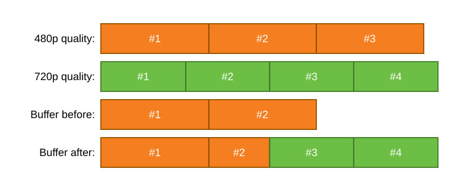

At [Demuxed 2022](https://2022.demuxed.com/), I gave a talk about rebuilding the HTML5 `<video>` element from scratch, handling buffering, decoding and rendering myself with [Custom Elements] and [WebCodecs].
Watch the talk below, or read on to find out why (and how) I built this crazy contraption.

<script>
import Video from "#lib/components/Video.svelte";
import Iframe from "#lib/components/Iframe.svelte";
import BaselineStatus from "#lib/components/BaselineStatus.svelte";
import Transcript from "./transcript.md";
</script>

## Watch the talk

<figure>

<Video
src="https://www.youtube.com/watch?v&equals;OBhlTcllq_E&list&equals;PLkyaYNWEKcOf98lZxnCcL6y7ZIVU3oSYO&index&equals;8"
title="Video of recording at Demuxed 2022"></Video>

<figcaption>

[Watch on YouTube](https://www.youtube.com/watch?v=OBhlTcllq_E&list=PLkyaYNWEKcOf98lZxnCcL6y7ZIVU3oSYO&index=8)

</figcaption>

</figure>

<figure>

<Iframe 
src="https://docs.google.com/presentation/d/e/2PACX-1vSypp6ODhxyzM0BqhXPNh3aGwk2nSbiasBqgHTuUC2Iy61B6qOegs0I7jKUJBPCZw/embed" 
title="Slides"></Iframe>

<figcaption>

[View on Google Slides](https://docs.google.com/presentation/d/1XK_Hwyt1fBHAqCRtlkocP5SsNjut4dKD/edit?usp=sharing&ouid=109623083800242291424&rtpof=true&sd=true)

</figcaption>

</figure>

<details>
<summary>Transcript</summary>
<Transcript />
</details>

## Motivation

For videos on the web, everything starts with the [HTML `<video>` element](https://developer.mozilla.org/en-US/docs/Web/HTML/Element/video):

```html
<video controls src="https://example.com/video.mp4"></video>
```

This gives you a basic but fully functional player right inside your website or web app, like so:

<!-- svelte-ignore a11y_media_has_caption -->

<video controls src="https://interactive-examples.mdn.mozilla.net/media/cc0-videos/flower.mp4"></video>

This is fine for short, simple videos. However, when video is a core part of your website's experience,
you'll want more advanced features, such as:

- Serving the same video in multiple qualities, and having the player automatically select the best quality
  based on the user's device capabilities and internet connection.
- Serving live content such as a sports broadcast, a 24/7 news channel, or a gaming livestream.

These features are generally not natively supported by the `<video>` element.
That's where the [Media Source Extensions ("MSE") API][MSE] comes in. It allows JavaScript code to
load the media content (usually by `fetch()`ing it from your server), and then append it in small
"chunks" to the `<video>` element's buffer. This API forms the backbone of all major web-based
streaming video players, such as [hls.js], [dash.js], [Shaka Player] and [THEOplayer].

However, even the MSE API has its limitations:

- MSE lets you control how your media is _buffered_, but not how it is _played_.
  - There's no way to control when the `<video>` element should start playing.
    Most browsers will initiate playback after a couple of audio and video frames have been buffered and decoded,
    but the precise thresholds vary between browsers, leading to different startup times.
  - For live streams, it's sometimes better to skip a couple of bad or missing frames instead of stalling the player.
    However, a JavaScript player can't easily detect or control that.
    Instead, it must handle this after the fact, by trying to recover _after_ the `<video>` element starts stalling.
- MSE requires media samples to be carried inside a container format, such as fragmented MP4 (CMAF) or WebM.
  - When the source media uses a different format (e.g. [MPEG-TS]), the JavaScript player must first extract the media samples
    from their original container ("demux") and then put them back into a new container ("mux" or "remux").
    This second step is pure overhead, since MSE will immediately extract those samples out of the new container again.

That's why I wanted to experiment with a video player that takes _full control_ over both buffering and playing
the media, _without_ using a `<video>` element or MSE. First of all, I wanted to better understand what the browser's
`<video>` element does, by trying to replicate it myself in JavaScript. I also wanted to see what kind of choices
you can make in the lower levels of a video player, choices that you usually don't get to make.
And of course, any new experiment is a great excuse to try out some fancy new web APIs. 😄

## Put the "element" in "video element"

Before we can decode a single frame, we need something to render it _into_. The `<video>` element
is first and foremost an HTML element: it has attributes, it fires events, it can be styled with CSS,
and it fits into the page like any other element. If our replacement is to be a believable stand-in,
it should behave the same way.

Luckily, the web platform has had [Custom Elements] for a while now. These let you define your own
HTML elements, backed by a JavaScript class. So the first step is about as simple as it gets:

```js
class BabyVideoElement extends HTMLElement {
  #canvas
  #canvasContext

  constructor() {
    super()
    const shadowRoot = this.attachShadow({ mode: 'open' })
    this.#canvas = document.createElement('canvas')
    this.#canvas.width = 300
    this.#canvas.height = 150
    shadowRoot.appendChild(this.#canvas)

    this.#canvasContext = this.#canvas.getContext('2d')
    this.#canvasContext.fillStyle = 'black'
    this.#canvasContext.fillRect(0, 0, this.#canvas.width, this.#canvas.height)
  }
}
customElements.define('baby-video', BabyVideoElement)
```

We use a `<canvas>`, since that's the closest thing the platform has to "a rectangle I can paint
pixels into myself". We put it inside a shadow root to keep it out of the page's DOM, just like the real
`<video>` element does with its internals. We fill it with black, and... that's it. `<baby-video>`
doesn't do anything useful yet, but you can already put it on a page and get a black rectangle. The
first baby steps of our `<baby-video>` element!

A video element without any controls isn't very useful, though. We could build a play button and a
seek bar ourselves with HTML, CSS and JavaScript, but there's no need: [Media Chrome] provides a whole
set of accessible, customizable UI components. If our `<baby-video>` looks like a `<video>` element and
quacks like a `<video>` element, then Media Chrome will treat it like a `<video>` element. So we get a
working play/pause button and seek bar for free, by wrapping our element in a `<media-controller>` and
adding the components we want:

```html
<media-controller>
  <baby-video slot="media"></baby-video>
  <media-control-bar>
    <media-play-button></media-play-button>
    <media-time-display show-duration></media-time-display>
    <media-time-range></media-time-range>
    <media-fullscreen-button></media-fullscreen-button>
  </media-control-bar>
</media-controller>

<script type="module" src="https://unpkg.com/media-chrome@0.12.0"></script>
<script src="./baby-video.js"></script>
```

Of course, none of these buttons do anything yet, because `<baby-video>` doesn't have any video to
show, let alone the ability to decode and play it.

## WebCodecs to the rescue

So how do we turn video data into pixels on our `<canvas>`? Until a few years ago, that was
(nearly) impossible _without_ a `<video>` element, although there were some exceptions.

For example, [VLC.js] is a port of VLC media player compiled to WebAssembly, which renders to `<canvas>` (for video)
and Web Audio (for audio). It's an amazing project that shows off the versatility of [their code](https://code.videolan.org/jbk/vlc.js).
However, since _everything_ is done in software, VLC.js can't take advantage of the hardware-accelerated decoders that
most CPUs and GPUs have. Hardware decoding is essential for smooth and battery-efficient playback
on all devices, which is why VLC.js is still more of an experiment than a production-ready streaming solution. [^1]

[^1]:
    I'd love to be proven wrong about this! Perhaps VLC.js could someday use WebCodecs to tap into
    hardware-accelerated decoding, and become a viable streaming solution on the web?

Fortunately, we now have the [WebCodecs] API, which allows JavaScript to talk directly to audio and video decoders.
This means you can build a JavaScript player with _full control_ over exactly when each audio and video
frame is decoded, when it's rendered, and what to do when frames are broken or missing.

Importantly, these are the _same_ decoders that the browser uses for its own video playback, so they can
be hardware-accelerated! This is a game changer: for the first time, we can use these decoders directly
from JavaScript, without going through a `<video>` element.

With that freedom comes a lot of responsibility. It's now up to the JavaScript player
to ensure smooth playback, and to deal with mishaps such as corrupted frames, or frames that arrive
too late or never arrive at all.

<BaselineStatus featureId="webcodecs"></BaselineStatus>

Replacing parts of the video pipeline with WebCodecs was becoming a running theme at Demuxed.
The year before, [Collin Miller replaced FFmpeg with WebCodecs](https://www.youtube.com/watch?v=zvsF6ZTYl0Y).
This time, it's the `<video>` element's turn.

## Feeding it data

WebCodecs gives us decoders, but we still need to get video data into our element. For a real
`<video>` element, that's what [MSE] is for. So just like we did for the `<video>` element itself,
we'll build our own version of the MSE API: a `BabyMediaSource` with its own `SourceBuffer`.

```js
const mediaSource = new BabyMediaSource()
video.srcObject = mediaSource
await waitForEvent(mediaSource, 'sourceopen')
mediaSource.duration = 30
const sourceBuffer = mediaSource.addSourceBuffer('video/mp4; codecs="avc1.640028"')

const segmentUrls = ['video_init.mp4', 'video_1.mp4', 'video_2.mp4']
for (const segmentUrl of segmentUrls) {
  const segmentData = await (await fetch(segmentUrl)).arrayBuffer()
  sourceBuffer.appendBuffer(segmentData)
  await waitForEvent(sourceBuffer, 'updateend')
}
```

The video data usually comes as fragmented MP4 (or CMAF), the same chunks that [hls.js], [dash.js] and
other players download for an HLS or DASH stream. Rather than writing an MP4 parser from scratch, I used
[mp4box.js], a battle-tested JavaScript library that parses MP4's box structure.

A fragmented MP4 stream generally consists of two kinds of segments:

- An **initialization segment**, containing a `moov` box with track and codec information. We parse
  this once, and turn it into a `VideoDecoderConfig` that we can use to configure a WebCodecs
  `VideoDecoder`.
- One or more **media segments**, each containing a `moof`/`mdat` pair with the encoded samples.
  We turn each sample into an `EncodedVideoChunk` (WebCodecs' name for a single encoded frame), and
  store them in our `SourceBuffer`, sorted by timestamp.

<figure>


<figcaption>

mp4box.js turns an fMP4 file into track info (for the `VideoDecoderConfig`) and a series of frames (for the `EncodedVideoChunk`s).

</figcaption>

</figure>

With mp4box.js doing the parsing, our `SourceBuffer.appendBuffer()` can turn incoming MP4 segments
into a growing list of `EncodedVideoChunk`s. Next up: decoding those chunks into frames, and drawing
those frames on the screen.

## Decoding and rendering a frame

With a buffer full of `EncodedVideoChunk`s, we finally get to the point of this whole exercise:
turning those chunks into pixels on the screen.

WebCodecs' `VideoDecoder` is refreshingly simple to use. You configure it with the
`VideoDecoderConfig` from the initialization segment, and then feed it `EncodedVideoChunk`s
one by one. For every chunk, the decoder eventually gives you a `VideoFrame` through its `output`
callback:

```js
class BabyVideoElement extends HTMLElement {
  #videoDecoder

  constructor() {
    // ...
    this.#videoDecoder = new VideoDecoder({
      output: (frame) => this.#onVideoFrameDecoded(frame),
      error: (error) => console.error(error)
    })
  }

  #onAnimationFrame() {
    const videoTrackBuffer = getActiveVideoTrackBuffer(this.#mediaSource)
    if (this.#videoDecoder.state === 'unconfigured') {
      this.#videoDecoder.configure(videoTrackBuffer.codecConfig)
    }
    const frame = videoTrackBuffer.findFrameForTime(this.currentTime)
    if (frame) {
      this.#videoDecoder.decode(frame)
    }
  }

  #onVideoFrameDecoded(frame) {
    this.#canvasContext.drawImage(frame, 0, 0, frame.displayWidth, frame.displayHeight)
    frame.close()
  }
}
```

`#onAnimationFrame()` is our clock. It runs once for every frame that the browser renders, looks up the
`EncodedVideoChunk` for the current time, and passes it to the decoder.

Rendering the resulting `VideoFrame` was the easiest part of the whole project.
[`CanvasRenderingContext2D.drawImage()`][drawImage] accepts a `VideoFrame` directly, just like an
``, a `<video>` or an `ImageBitmap`. So when a frame comes out of the decoder,
`#onVideoFrameDecoded()` draws it onto the `<canvas>` and then closes it.

Put the clock, the decoder and `drawImage()` together, and `<baby-video>` can already play a video
from start to end. When I tried it with [Big Buck Bunny](https://peach.blender.org/), it mostly worked,
except that the picture was smearing and stuttering. Getting frames on the screen was the easy part.
The hard part was yet to come.

## The double-decode bug

The smearing had a simple cause: I had been treating two different frame rates as if they were the same.

The browser calls our render loop once per _display_ refresh, typically 60 times per second. However, my
Big Buck Bunny test video was encoded at 30 frames per second. The render loop grabbed "the chunk for the
current time" on every call, so for about half of those calls, it passed the _same_ `EncodedVideoChunk` to
the decoder a second time.

That would be harmless if every frame could be decoded on its own, but that's not the case in a
compressed video. To save space, video codecs encode most [frames][picture-types] as a _delta_ against
the frame(s) before them, rather than as a full image. Instead of pixel colors, a delta frame mostly
describes which "macroblocks" (blocks of pixels) of the previous frame to keep in place or move to a
different position, plus a small residual to correct whatever the motion didn't capture. The decoder
keeps the reconstructed frame in its internal state, to use as the reference for the _next_ delta frame.

If you decode the same delta chunk twice, the decoder doesn't show the same picture again. It applies
the same motion and residual a second time, on top of a frame that was already shifted once. That
corrupts the decoder's state, and after dozens of frames, you get the smearing I was seeing.

The fix is simple: remember which chunk was decoded last, and skip it if the render loop asks for that
same chunk again.

```js
#onAnimationFrame() {
  // ...
  const frame = videoTrackBuffer.findFrameForTime(this.currentTime);
  if (frame === this.#lastDecodedFrame) {
    return;
  }
  this.#videoDecoder.decode(frame);
  this.#lastDecodedFrame = frame;
}
```

With that check in place, Big Buck Bunny finally played _as the Blender Foundation intended_.

## Seeking should just work, right?

Playback was looking good, so surely seeking (jumping forward or backward in the video) would just work
too? After all, `#onAnimationFrame()` already looks up the chunk for `currentTime` on every frame, and
the seek bar simply changes `currentTime`. I dragged the seek bar back to the start, expecting to see
the opening shot of Big Buck Bunny again.

Instead: a blocky, garbled mess. Again. 🙄

Once again, the problem comes down to how compressed video works. As we saw [earlier][picture-types],
most frames are delta frames that only make sense relative to the frames before them. After a seek,
decoding _only_ the delta frame we landed on is just as broken as decoding a frame twice: the decoder
doesn't have the reference frame that the delta frame expects.

To decode a frame after a seek, we first need to decode every frame it (indirectly) depends on:

- If the seek landed further ahead in the group of pictures ("GOP") we were already decoding, we can
  continue where we left off, and decode everything between the last decoded chunk and the new one.
- Otherwise, there's no state to continue from. We have to start over from the keyframe at the start of
  the target GOP, and decode our way forward to the target chunk.

Either way, we send every chunk along the way to the `VideoDecoder`, but we only draw the last one onto
the `<canvas>`. So we generalize our earlier fix: instead of skipping _duplicate chunks_, we skip
_every chunk except the one we want to render_. The logic for walking back to a keyframe goes into
`getDecodeDependenciesForFrame()`:

```js
#onAnimationFrame() {
  const videoTrackBuffer = getActiveVideoTrackBuffer(this.#mediaSource);
  const targetFrame = videoTrackBuffer.findFrameForTime(this.currentTime);
  if (!targetFrame || targetFrame === this.#lastDecodedFrame) {
    return;
  }
  const decodeQueue = videoTrackBuffer.getDecodeDependenciesForFrame(targetFrame, this.#lastDecodedFrame);
  if (this.#videoDecoder.state === "unconfigured") {
    this.#videoDecoder.configure(decodeQueue.codecConfig);
  }
  for (const frame of decodeQueue.frames) {
    this.#videoDecoder.decode(frame);
  }
  this.#lastDecodedFrame = targetFrame;
}
```

As a nice bonus, this also fixes a case we had been ignoring so far. What happens when the _display_
frame rate is lower than the _video_ frame rate, so that more than one video frame falls between two
animation frames? That's the same problem as seeking, just over a much shorter distance, so the same
code fixes it.

With that in place, seeking finally showed the opening shot of Big Buck Bunny. The glitchy mess was gone.

This does come at a cost, though. The further a delta frame is from its keyframe, the more frames we have
to decode after a seek before we can show anything. Fewer keyframes means slower seeking. That's one of
the reasons why HLS and DASH streams typically have a keyframe every two seconds or so: it's a trade-off
between compression efficiency (keyframes are expensive) and how fast seeking (and switching qualities)
feels to the viewer.

## Managing the buffer

So far, `<baby-video>`'s buffer only ever grows: every appended segment adds more `EncodedVideoChunk`s
that stay around forever. That's fine for a 30-second demo clip, but with a two-hour movie or a 24/7
livestream, it's only a matter of time before the tab runs out of memory and crashes. A real player
also needs to remove media that it no longer needs.

MSE's `SourceBuffer` has a method for this: `SourceBuffer.remove(start, end)`, which removes every frame
with a presentation time between `start` and `end`. Once again, delta frames make this tricky. If we
remove a frame that other frames depend on, those frames can no longer be decoded, so they must be
removed as well. In practice, this means removing entire GOPs: if you remove a keyframe, every delta
frame that depends on it (up to the next keyframe) must go too.

```js
class BabySourceBuffer extends EventTarget {
  remove(start, end) {
    // Removing a keyframe takes its whole GOP down with it,
    // so round the removal range out to GOP boundaries first.
    const { start: gopStart, end: gopEnd } = this.#alignToGroupOfPictures(start, end)
    this.#chunks = this.#chunks.filter(
      (chunk) => chunk.timestamp < gopStart || chunk.timestamp >= gopEnd
    )
  }
}
```

That leaves the question of _when_ to call `remove()`. There are two options:

- **Proactively**, before appending new data. While playing forward, chunks that are well behind
  `currentTime` probably won't be needed again, so we can remove them to make room. We shouldn't be too
  eager, though: if we remove the keyframe that the current GOP depends on, we'd break our own decoder.
  A safe rule of thumb is to never remove anything within one keyframe interval of `currentTime`. After
  seeking backwards, the same applies in the other direction: chunks that are far _ahead_ of
  `currentTime` can be removed too.
- **Reactively**, when the buffer is full. No matter how proactive we are, `SourceBuffer.appendBuffer()`
  can still throw a `QuotaExceededError` if there isn't enough room for the new data. When that happens,
  the player should lower its buffering goal (how far ahead it tries to buffer), remove whatever it
  safely can, and try the append again later, once playback has advanced far enough to free up more room.

With both proactive and reactive eviction in place, `<baby-video>` can keep buffering indefinitely
without eating up all of the tab's memory. Old chunks make way for new ones, and when the buffer is full,
the player can recover gracefully instead of giving up.

## Switching between qualities

A player that only plays a single, fixed quality isn't very useful on a real network. Either it picks
a safe but blurry quality, or a sharp one that stalls as soon as your connection slows down. Real
streaming players constantly decide which quality to buffer next, based on bandwidth, device
capabilities, and how full the buffer is. `<baby-video>` doesn't make that decision itself, but it
does need to handle the _result_: a stream of segments that can switch from, say, 480p to 720p from one
segment to the next.

The decoder is the easy part. Each quality has its own `VideoDecoderConfig`, so switching quality means
reconfiguring the `VideoDecoder` before decoding the first frame of the new quality.
`getDecodeDependenciesForFrame()` already returns the `codecConfig` for the GOP of the target frame, so
`#onAnimationFrame()` barely needs to change. Instead of only configuring the decoder when it's
`"unconfigured"`, it also reconfigures it whenever the codec config changes:

```js
#onAnimationFrame() {
  // ...
  const decodeQueue = videoTrackBuffer.getDecodeDependenciesForFrame(targetFrame, this.#lastDecodedFrame);
  if (this.#videoDecoder.state === "unconfigured" || this.#lastVideoDecoderConfig !== decodeQueue.codecConfig) {
    this.#videoDecoder.configure(decodeQueue.codecConfig);
    this.#lastVideoDecoderConfig = decodeQueue.codecConfig;
  }
  // ...
}
```

The harder part is what happens _in the buffer_. Different qualities of the same video don't always
split their segments at the same timestamps: one quality might have 4-second segments, while another
has 6-second segments. So when the player switches quality, the new segment can overlap with a segment
of the old quality that's already in the buffer.

Suppose we've buffered two 480p segments, and then switch to 720p starting from segment #3. That 720p
segment overlaps with the end of our second 480p segment. According to MSE's coded frame processing
algorithm, the overlapping old frames are removed to make room for the new ones: the second 480p
segment gets cut short, and the 720p segment takes over from there. If playback hasn't reached that
point yet, nobody notices. But if `currentTime` is already inside that second segment, we've pulled the
rug out from under the decoder in the middle of a GOP. That can cause the same kind of stalls or
glitches we saw with the double-decode bug and with seeking.

<figure>



<figcaption>

Switching from 480p to 720p when segment durations don't line up: the last buffered 480p segment gets cut short to make room for the new 720p segment.

</figcaption>

</figure>

So just like with buffer eviction, the player should avoid switching quality too close to `currentTime`,
and leave a safety margin before the switch reaches the decoder. That's not always possible, though. If
the buffer is nearly empty because the network can't keep up, switching down to a lower quality right
away (overlap and all) may be the only way to avoid a stall.

The cleanest fix isn't in the player at all. If the encoder aligns segment boundaries across all
qualities, so that segment #3 always starts at the same timestamp in every quality, there's never any
overlap to begin with, and switching quality is as simple as reconfiguring the decoder.

## Conclusion

So there we have it: a `<baby-video>` element, built from a `<canvas>`, a custom `MediaSource` and
`SourceBuffer`, and WebCodecs, that covers most of what the real `<video>` element does. It plays,
pauses, seeks, buffers, removes what it no longer needs, and switches quality mid-stream. You can
[try it yourself](https://mattiasbuelens.github.io/baby-video/) in any browser that supports WebCodecs,
and the full source code is on [GitHub](https://github.com/MattiasBuelens/baby-video) if you want to poke
around.

The biggest lesson for me was how much complexity hides behind "decode the next frame". Almost every
problem in this project, from the first render loop to the last quality switch, came down to the same
thing: compressed video isn't a sequence of pictures, but a sequence of _instructions_ for reconstructing
pictures, and most of those instructions only make sense after the ones that came before. The `<video>`
element hides all of that from you. Only when you try to rebuild it yourself do you notice how much
bookkeeping is going on underneath.

The other lesson: a video player's job isn't just decoding. It also has to decide _what not to decode_
and _what to throw away_. Skipping duplicate chunks, going back to a keyframe after a seek, removing old
GOPs before the buffer fills up, not switching quality too close to `currentTime`: you don't think about
any of that when you only consider the happy path, but all of it matters.

Finally, WebCodecs held up well. This was my first real project with it, and even though it's still a
fairly young and low-level API, it did everything I asked of it, including using the browser's
hardware-accelerated decoders. I'd love to see it land in more browsers, so that experiments like this
one don't have to stay Chrome-only party tricks.

## Further reading

If you're curious to learn more about WebCodecs, here are a few places to start:

- The [WebCodecs samples](https://w3c.github.io/webcodecs/samples/) from the spec repository, including
  one that plays video _and_ audio together.
- ["WebRTC and Real-Time Applications: WebCodecs and the Next Generation of Web Media APIs"](https://www.youtube.com/watch?v=U8T5U8sN5d4),
  a talk by Bernard Aboba, Chris Cunningham and Paul Adenot at the 2021 Real-Time Communications Conference,
  about WebCodecs from the people who designed it.
- ["Video processing with WebCodecs"](https://developer.chrome.com/docs/web-platform/best-practices/webcodecs?hl=en)
  on developer.chrome.com, a more general introduction that also covers use cases beyond playback, such as
  video editing and effects.

[Custom Elements]: https://developer.mozilla.org/en-US/docs/Web/API/Web_components/Using_custom_elements
[drawImage]: https://developer.mozilla.org/en-US/docs/Web/API/CanvasRenderingContext2D/drawImage
[Media Chrome]: https://www.media-chrome.org/
[WebCodecs]: https://developer.mozilla.org/en-US/docs/Web/API/WebCodecs_API
[MSE]: https://developer.mozilla.org/en-US/docs/Web/API/Media_Source_Extensions_API
[hls.js]: https://github.com/video-dev/hls.js
[dash.js]: https://dashjs.org/
[Shaka Player]: https://github.com/shaka-project/shaka-player
[THEOplayer]: https://www.theoplayer.com/
[MPEG-TS]: https://en.wikipedia.org/wiki/MPEG_transport_stream
[VLC.js]: https://videolabs.io/communication/vlcjs-demo/vlc.html
[mp4box.js]: https://github.com/gpac/mp4box.js/
[picture-types]: https://en.wikipedia.org/wiki/Video_compression_picture_types
