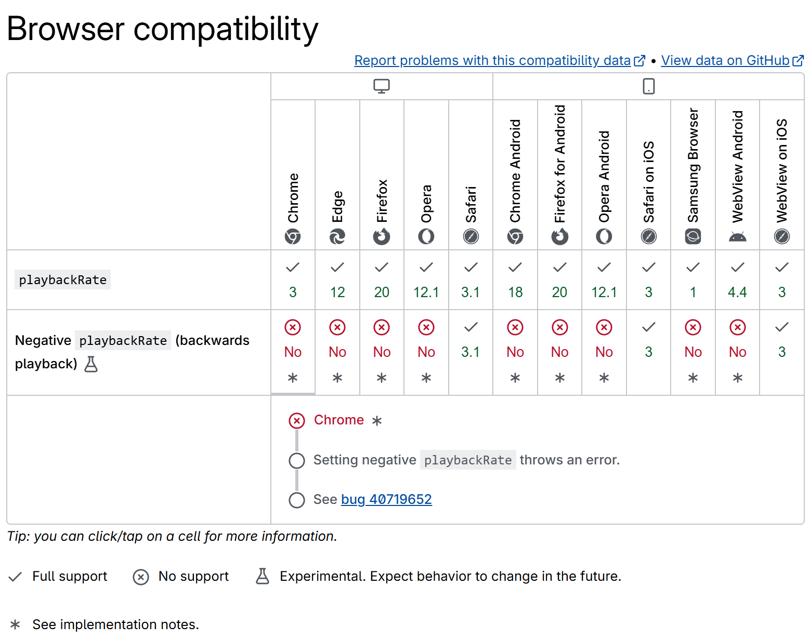
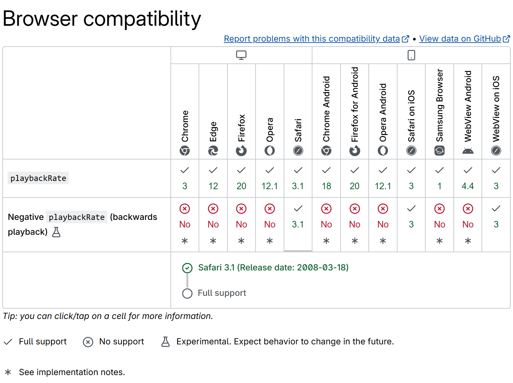
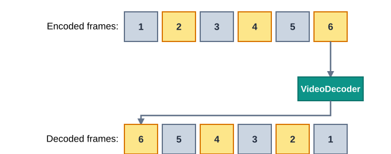
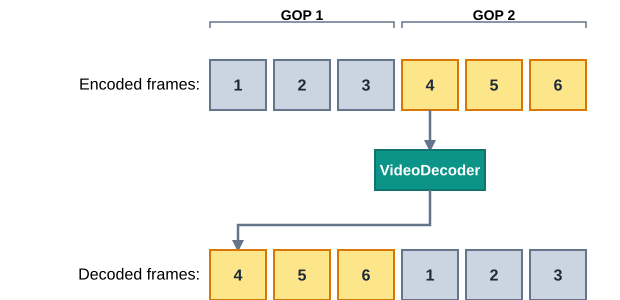

At [Demuxed 2023](https://2023.demuxed.com/), I presented a talk about how I extended [baby's first HTML5 `<video>` element](/post/talk-baby-video/) to support reverse playback.
You can watch the talk below, and read along for more details about why and how I built this.

<script>
import Video from "#lib/components/Video.svelte";
import Iframe from "#lib/components/Iframe.svelte";
import BaselineStatus from "#lib/components/BaselineStatus.svelte";
import Transcript from "./transcript.md";
import reversePlaybackSafari from "./reverse-playback-safari.mp4";
import reverseGlitched from "./reverse-glitched.mp4";
</script>

## Watch the talk

<figure>

<Video
src="https://www.youtube.com/watch?v&equals;0sYeEpR10sY&list&equals;PLkyaYNWEKcOesxC4VpHJtbjnzuN6r1NGg&index&equals;15"
title="Video of recording at Demuxed 2023"></Video>

<figcaption>

[Watch on YouTube](https://www.youtube.com/watch?v=0sYeEpR10sY&list=PLkyaYNWEKcOesxC4VpHJtbjnzuN6r1NGg&index=15)

</figcaption>

</figure>

<figure>

<Iframe 
src="https://docs.google.com/presentation/d/e/2PACX-1vQnFNJhcL1OuhcbqD4CV7_LHhcoZ-Utj3CoO6twTUvsN69lxAiMwqdUI4S2s27uA-yWwKbgVuipPWvW/pubembed?start=false&loop=false&delayms=3000" 
title="Slides"></Iframe>

<figcaption>

[View on Google Slides](https://docs.google.com/presentation/d/e/2PACX-1vQnFNJhcL1OuhcbqD4CV7_LHhcoZ-Utj3CoO6twTUvsN69lxAiMwqdUI4S2s27uA-yWwKbgVuipPWvW/pub?start=false&loop=false&delayms=3000)

</figcaption>

</figure>

<details>
<summary>Transcript</summary>
<Transcript />
</details>

## Motivation

Video on the web only ever goes one way: forward. Press play, and time marches on. Why would you ever
need it to go the other way?

Turns out there's a few good reasons:

- **Video editing.** Finding the exact frame where a cut or a transition happens is a lot easier if you can nudge backwards and forwards around that point, instead of repeatedly seeking to guess where you landed.
- **Video-assisted refereeing.** Scrub through a replay to find the exact frame where an attacker's boot touches the ball, so you can freeze it and draw an imaginary line across the pitch. (Or something like that, I don't actually know how the offside rule works.)
- **Funny GIFs.** The entire reason why the internet exists.

<figure>


<figcaption>

Peak internet content, now available in reverse.

</figcaption>

</figure>

## Isn't this already possible?

Surely someone thought of this already. And indeed, [MDN's docs on `playbackRate`][playbackRate] say exactly what we want to hear:

> A negative `playbackRate` value indicates that the media should be played backwards, but support for this is not yet widespread.

"Not yet widespread", you say? Let's see if we can get more details from [the browser compatibility table][playbackRate-compat].



That's a "no" across the board, except for Safari. Surely that one works?



_Supposedly_, Safari has supported negative `playbackRate` since version 3.1, released all the way back in 2008.

Let's find out: load a video directly in Safari, open the console, and set `playbackRate` to `-1`.

<video controls muted src={reversePlaybackSafari}></video>

Technically moving backwards, but at maybe one or two frames per second. It's less "reverse playback" and more "a slideshow, played in the wrong order." A valiant effort, but it doesn't count.

So in reality, none of the major browsers actually support reverse playback, despite what the spec and the compatibility tables might promise. Are we out of options?

## Recap: baby's first video element

If the browser's own `<video>` element won't play in reverse, why not build one that will? I already did most of the work for [last year's talk](/post/talk-baby-video/): `<baby-video>`, an HTML custom element that reimplements a chunk of the `<video>` element from scratch.

<figure>


<figcaption>

Yes, we're back. No, my slide design still hasn't improved.

</figcaption>

</figure>

Quick recap:

- Implements part of the `<video>` element's own API: `play()`, `pause()`, `currentTime`, events, and so on.
- Implements the Media Source Extensions API too: `MediaSource`, `SourceBuffer`, `appendBuffer()`.
- Parses incoming fragmented MP4 into individual encoded video frames.
- Decodes those frames with the [WebCodecs API][WebCodecs].
- Renders the decoded frames onto a `<canvas>`.

We've already reimplemented buffering, decoding, and rendering video ourselves. Now, we're going to make each of those three steps run _backwards_ instead of forwards.

## Step 1: buffering in reverse

Every streaming player's buffering loop looks more or less the same:

1. If there's enough buffer **after** current time, wait.
2. Find the **next** segment **after** the **end** of the buffer.
3. Download and append that segment.
4. If it was the **last** segment, we're done buffering.
5. Otherwise, repeat.

To buffer in reverse, flip the direction of every one of those lookups:

1. If there's enough buffer **before** current time, wait.
2. Find the **previous** segment **before** the **start** of the buffer.
3. Download and append that segment.
4. If it was the **first** segment, we're done buffering.
5. Otherwise, repeat.

We'll implement this as a single buffering algorithm, with a `forward` flag threaded throughout to decide on the direction in each step. The following sample is trimmed down from [the real loop][demo-app], which also handles evicting old buffer and aborting on a seek:

```js
async function fillBuffer(sourceBuffer) {
  while (true) {
    const forward = video.playbackRate >= 0

    // Wait until we're running low on buffer in our playback direction.
    while (true) {
      const range = sourceBuffer.buffered.find(video.currentTime)
      if (!range) break // no buffer at all, fetch immediately
      const bufferedAmount = forward
        ? range.end - video.currentTime
        : video.currentTime - range.start
      if (bufferedAmount <= bufferGoal) break
      await waitForEvent(video, ['timeupdate', 'ratechange'])
    }

    // Find, download and append the next segment in that direction.
    const range = sourceBuffer.buffered.find(video.currentTime)
    const nextTime = range ? (forward ? range.end : range.start - 0.001) : video.currentTime
    const nextSegment = getSegmentForTime(nextTime)
    const segmentData = await (await fetch(nextSegment.url)).arrayBuffer()
    sourceBuffer.appendBuffer(segmentData)
    await waitForEvent(sourceBuffer, 'updateend')

    // Stop once we've reached the front of the video (in reverse) or the end (forward).
    if (forward ? nextSegment.isLast : nextSegment.isFirst) {
      return
    }
  }
}
```

Nothing about a segment's own contents changes here, we're just walking through the list of segments back to front instead of front to back when `playbackRate` goes negative. Buffering fills up from the back of the video towards the front.

Next up, let's update the decoder to also work when we reverse its direction.

## Step 2: decoding in reverse

We've appended our fMP4 segments and parsed them into individual encoded frames. Decoding them in reverse sounds like it should be just as simple as buffering in reverse: start with the last frame, run it through WebCodecs' `VideoDecoder`, store the resulting decoded frame, then work backwards from there.

<figure>



<figcaption>

Feed the encoded frames into the decoder back to front, get decoded frames back in that same order. Should work, right?

</figcaption>

</figure>

Let's try it on Big Buck Bunny:

**⚠️ Content warning: the clip below contains flashing images.**

<video controls muted src={reverseGlitched}></video>

That is not how Big Buck Bunny is supposed to look. As video engineers, we've all seen those green frames before, and they haunt our nightmares.

The problem is that video is mostly made up of P‑frames and B‑frames, not full images: they only encode the difference (motion and error) relative to other nearby frames, so they can't be decoded independently. Feed them to the decoder in the wrong order, and there's no previous frame for them to be a difference _from_ anymore, hence the green mess.

So we can't just feed frames to the decoder in reverse. But we don't have to give up on reordering entirely, either:

- Frames within one group of pictures ("GOP") still need to go to the decoder in their _original_ order, since they depend on each other.
- We _can_ still change the order in which we send entire GOPs.

<figure>



<figcaption>

To decode frame 6, we still need to decode frames 4 and 5 first. So we send GOP 2 through the decoder before GOP 1, keeping each GOP's own frame order intact.

</figcaption>

</figure>
[demo-app]: https://github.com/MattiasBuelens/baby-video/blob/6d908d377d052b8eafbb29ecddffcde1e59d9b18/demo/app.ts#L121-L188
[playbackRate]: https://developer.mozilla.org/en-US/docs/Web/API/HTMLMediaElement/playbackRate
[playbackRate-compat]: https://developer.mozilla.org/en-US/docs/Web/API/HTMLMediaElement/playbackRate#browser_compatibility
[WebCodecs]: https://developer.mozilla.org/en-US/docs/Web/API/WebCodecs_API
